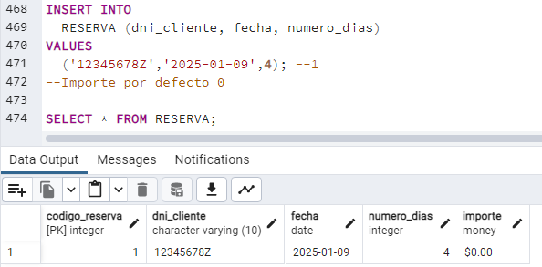

# Proyecto Administración y diseño de bases de datos. Hotel Serrucho
* Autores: 
    * Lucas Pérez Rosario (alu0101399928)
    * Saúl Sosa Díaz (alu0101404141)
    * Kilian González Rodríguez (alu0101222325)

## Resumen
Este repositorio está dedicado a la implementación y despliegue de una base de datos para la gestión de un hotel, proyecto correspondiente a la asignatura de Administración y Diseño de Bases de Datos. En su interior, se incluyen varios componentes clave:

1. **Diagramas de Modelado**: El repositorio contiene tanto el diagrama Entidad-Relación como el modelo relacional, facilitando una comprensión visual de la estructura de datos.

2. **Estructura de la Base de Datos**: Se proporciona una carga inicial de datos, junto con la definición de tablas y triggers, asegurando así su correcta estructuración y funcionamiento.

3. **Scripts para Operaciones de la Base de Datos**: Esto abarca scripts para creaciones de borrados y actualizaciones, esenciales para el manejo de la base de datos.

4. **Ejemplos de Consultas y API REST**: Para validar la funcionalidad, se incluyen ejemplos de consultas de prueba. Estos ejemplos abarcan desde consultas estándar hasta inserciones incorrectas, demostrando la robustez del sistema. Además, se implementa una API REST para interactuar con la base de datos.

## Estructura de directorios
```bash
    .
    ├── Creaciones                  # Definiciones de las tablas y triggers.
    ├── Inserciones                 # Inserciones de carga de la base de datos, incluye operaciones correctas e incorrectas.
    ├── Operaciones                 # Operaciones de borrado e actualización de los datos.
    ├── app.py                      # Implementación de la API REST de la base de datos.
    ├── creacion_base_datos.sql     # Script para desplegar la base de datos.
    ├── img                         # Imágenes para la demostración del correcto funcionamiento de las funcionalidades implementadas.
    │   ├── comprobaciones
    │   ├── consultas
    │   ├── modelado
    │   ├── api 
    │   └── funcionalidades
    ├── informe_g7.pdf                         
    └── requirements.txt            # Dependencias para ejecutar la API REST
```


## Modelo entidad relación:
En la siguiente imagen se muesta el modelo entidad relación de la base de datos del proyecto.


## Modelo relacional:
A continuación se muestra el diagrama relacional de la base de datos.

```

Proveedor(PK:{codigo_proveedor}, nombre_proveedor, telefono)

Servicio(PK:{codigo_servicio},  nombre_servicio, tarifa, premium)

Contrato(PK:{codigo_contrato, codigo_proveedor, codigo_servicio}, FK:{codigo_proveedor, codigo_servicio}, fin_vigencia, activo)

CorreoElectronico(PK:{correo}, FK:{dni_cliente})

Cliente(PK:{dni_cliente}, nombre, apellido1, apellido2, premium)

Habitacion(PK:{codigo_habitacion}, tarifa, tipo)

RegistroMantenimiento(PK:{codigo_registro, Fecha}, FK:{codigo_habitacion}, descripcion)

Reserva(PK:{codigo_reserva}, FK:{dni_cliente}, fecha, numero_dias, importe)

ReservaHabitacion(PK:{codigo_reserva, codigo_habitacion}, FK:{codigo_reserva, codigo_habitacion})

ReservaServicio(PK:{codigo_reserva, codigo_servicio}, FK:{codigo_reserva, codigo_servicio})

Empleado(PK:{dni_empleado}, FK:{dni_supervisor}, nombre, apellido1, apellido2, salario, horas_totales)

Departamento(PK:{codigo_departamento}, FK:{dni_gerente}, nombre_departamento)

Empleado_Departamento(PK:{dni_empleado, codigo_departamento}, FK:{dni_empleado, codigo_departamento})

Curso(PK:{codigo_curso}, FK:{codigo_departamento}, nombre_curso, numero_horas, categoria)

Empleado_realiza_Curso(PK:{dni_empleado, codigo_curso}, FK:{dni_empleado, codigo_curso}, fecha)

Departamento_Servicio(PK:{codigo_servicio, codigo_departamento}, FK:{codigo_servicio, codigo_departamento})

Jornada(PK:{codigo_jornada}, fecha_hora_entrada, fecha_hora_salida)

Empleado_Jornada(PK:{dni_empleado, codigo_jornada}, FK:{dni_empleado, codigo_jornada})

```


## Carga y despliegue de la base de datos.
Se ha creado un script SQL llamado: *creacion_base_datos.sql* localizado en la raíz del repositorio que se puede ejecutar directamente desde postgreSQL.
Este fichero no es más que la unión de los ficheros:
* Creacion_tablas.sql
* Creacion_triggers.sql
* Insercion_datos_correctos.sql
* Operaciones_Borrado_Actualizacon.sql

Recomendamos usar [Docker](https://www.docker.com/) para desplegar postgreSQL y ejecutar el Script. Se puede descargar desde el siguiente enlace: [Descarga Docker](https://www.docker.com/products/docker-desktop/).

## Correcto funcionamiento de la base de datos.
### Inserciones incorrectas.
* Los clientes estándar no pueden reservar servicios premium.  


* Los cursos no podrán tener 0 o menos horas de curso.  


* La tarifa de las habitaciones debe ser mayor a 0.  


* La hora de entrada de una jornada debe ser menor a la de salida.  


* Los empleados no podrán tener jornadas solapadas.  


* Las reservas deben tener ser de más de 0 días.  


* Las habitaciones no podrán tener reservas simultáneas.  


* No puede existir un contrato simultáneo de un mismo proveedor para un mismo servicios.  


* Un empleado no puede trabajar en un departamento sin haber hecho antes cursos de ese departamento.  


* El empleado no puede tener sueldo negativo.  


* El empleado debe tener sueldo entre 700 y 10000€.  


* Los emails deben seguir el estándar RFC5322.  


* Los DNI deben seguir un formato concreto.  


### Funcionalidades

* Cálculo de horas trabajadas por empleado, que se calcularán dependiendo de las horas de jornada trabajadas.  
    * Pre-inserción de datos.  
    
    * Post-inserción de datos.  
    

* Cálculo del importe de la reserva.
    * Pre-inserción de datos.   
    
    * Post-inserción de datos.  
    

* Un gerente trabaja en el departamento del que se hace cargo.
    * Pre-inserción de datos.  
    
    * Post-inserción de datos.  
    


### Algunas Consultas

* Queremos crear un nuevo departamento y para ello queremos otorgarle el puesto de gerente a nuestro empleado con más horas trabajadas.  


* Se nos han ofertado a la compañia una serie de cursos gratis para 3 empleados queremos reforzar los conocimientos de los empleados con menos cursos.  


* Queremos saber cual es el cliente que más a invertido en nuestro hotel para ofrecerle una tarjeta de descuento a modo de agradecimiento.  


* Queremos saber los cursos que han realizado cada uno de nuestros empleados así como el numero total de horas dedicadas.  


* Queremos el nombre de los clientes premium así como el listado de reservas.  


* Queremos saber cuales son los servicios que más veces ha sido solicitado, para replantearnos la distribución de responsabilidades de los empleados.  


* Estamos planeando reducir el numero de servicios no premium, para ello queremos saber cuales son los 5 servicios que menos dinero generarán en las reservas planificadas.  


* Ha venido un grupo de personas que necesitan alquilar una habitación ahora, para ello necesitamos la lista de habitaciones sin ocupar actualemente.  


* Estamos pensando en reorganizar nuestra estructura de departamentos y reasignar a los empleados, para ello queremos saber los empleados que trabajan en cada departamento	el número de horas que han trabajado para la empresa, así como el numero de trabajadores de cada departamento.  


* Dado un DNI de un cliente, en concreto 12345678Z, dar las reservas que tiene a su nombre.  


## Uso de la API
### Dependencias
Los paquetes necesarios se encuentran en el fichero *requirements.txt*.
Se pueden instalar utilizando el siguiente comando.
```bash
pip install -r requirements.txt
```

Recomendamos crear un entorno virtual para la instalación de los paquetes, se puede crear y activar con los siguientes comandos:
```bash
python3 -m venv venv
. venv/bin/activate
```

### Ejecución de la API REST
Para desplegar la aplicación debemos utilizar el siguiente comando:
```bash
flask --app app run --host 0.0.0.0 --port 8080
```
La tabla correspondiente a los *endpoints* de la API las puede consultar en el informe del proyecto. 

### Ejemplo de ejecucion de la API REST
Hemos utilizado Thunder Client para realizar las peticiones a la API. 
A continuación se muestran algunas ejemplos del uso de la API.

* Obtener los servicios del hotel.


* Obtener lista de habitaciones disponibles actualmente.


* Obtener las reservas asociadas a un cliente.


* Crear una reserva en el hotel.


* Modificar una reserva, que no haya empezado, asociada a un cliente.


* Eliminacion de reserva mediante el código de reserva si el dni del cliente es correcto


## Referencias:
* [Docker](https://www.docker.com/): Para crear entonos de software.
* [Descarga Docker](https://www.docker.com/products/docker-desktop/): Descarga de Docker.
